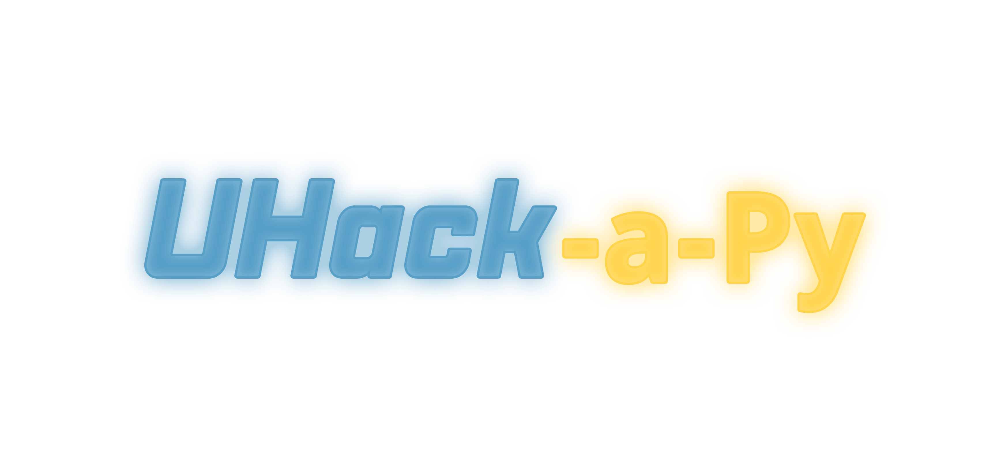

UHack-a-Py is een framework om simpel games te maken in Python, op basis van PyGame.
Deze GitHub bevat het framework zelf en een aantal voorbeeldgames.

## Installatie

### Lokale installatie
1. Installeer het framework vanuit de [GitHub release](https://github.com/UHasselt-DSI-Data-Systems-Lab/ahack-a-py/releases).
2. Zorg dat je Python 3.10 of hoger hebt geïnstalleerd.
3. Installeer de vereiste pakketten met pip:
```bash
pip install pygame
```

### USB-stick installatie V2 (Thonny)
(We noemen de USB-stick "E:") 
1. Download [Thonny](https://thonny.org/), specifiek de "Portable variant with 64-bit Python 3.10" (thonny-4.1.7-windows-portable.zip : 31 MB)
2. Pak de zip uit naar een nieuwe folder `E:\.environment`. De python.exe hoort zich dan te bevinden op `E:\.environment\python.exe`.
3. Kopieër de Thonny configuratie door de `Portable Environment V2\configuration.ini` in `E:\.environment\user_data` te plaatsen.
4. Kopieër de venv configuratie door `Portable Environment V2\pyvenv.cfg` in `E:\.environment\venv` te plaatsen.
5. Plaats de `games` en `Assets` folders in de root `E:\`.
6. Plaats de `Run Thonny.exe` in de root `E:\`.

### USB-stick installatie V1 (VSCode) (Niet aangeraden door performance issues)
... (yet to come)

## Gebruik
1. Maak een nieuw Python-bestand aan, bijvoorbeeld `main.py`.
2. Importeer het UHack-a-Py framework.
3. Roep de `while playing()` functie op om je game loop te starten.

Een zeer minimaal voorbeeld vind je onder [games/your_project/game.py](games/your_project/game.py).
Een complexer voorbeeld vind je onder [games/simple_game/game.py](games/simple_game/game.py).

De 'escape'-toets sluit het spel altijd af.

## Repository structuur

*   `/Assets`: Bevat alle assets voor de spellen, zoals afbeeldingen, etc. Het is georganiseerd per asset pack van Kenney.
*   `/games`: Bevat de voorbeeldspellen en een sjabloon voor nieuwe spellen.
    *   `/games/your_project`: Een sjabloon voor je eigen spel.
    *   `/games/simple_game`: Een simpel voorbeeldspel.
    *   `/games/bullet_hell`: De bullet-hell template, inclusief de guides en templates.
    *   `/games/framework`: Het framework waarop de games werken.
*   `documentation.md`: De documentatie voor het framework.
*   `README.md`: Dit bestand.

> [!WARNING]
> De OOP-versies van de templates zijn nog niet afgewerkt!

## Documentatie

Het framework voorziet enkele functies en variabelen die je kan gebruiken in je games.
In de [documentatie](documentation.md) vind je een overzicht van alle functies en variabelen, inclusief uitleg en voorbeelden.
